# 🎲 Buckshot Roulette — Web Edition

A browser-based reimagining of the original terminal Buckshot Roulette game: two players, one shotgun, and a chamber of live and blank shells in an order neither of them knows.

Built with vanilla HTML, CSS, and JavaScript (ES Modules) — no frameworks, no build step, no backend.

## 🔫 Overview

Each round loads a randomized chamber of live and blank shells. On your turn, shoot yourself or your opponent — a blank on yourself keeps your turn, anything else passes it. Between shots, items drawn from a shared table can shift the odds, reveal information, or turn a losing position around. Whoever runs out of health first loses the round; scores carry across a match until either player ends it.

## ✨ Features

- **1v1 local pass-and-play** — no accounts, no networking, no AI opponent, by design
- **8 items** — Saw, Magnifying Lens, Phone, Beer, Smoke, Deadly Pill, Chains, Inverter — each with its own effect, sound, and on-screen log
- **Swap-on-full inventory** — picking up an item when your inventory is full lets you choose what to discard in its place
- **Dynamic chamber generation** — chamber length (2–8 shells) and live/blank split are both randomized, with every length equally likely regardless of how many splits exist within it
- **Full audio-visual sequencing** — a distinct aim → pause → bang rhythm on every shot, a per-shell reload sequence when the chamber empties, and a mobile-specific vertical aim direction
- **Persistent match history** — head-to-head records between any two player names, stored locally
- **Global stats & achievements** — over 20 tracked records (streaks, comebacks, item usage, round timing) with named badges for whoever holds them
- **Configurable settings** — health range, item range, player names and colors, all validated before saving
- **Responsive layout** — desktop, tablet, and mobile, with the shotgun's aim direction adapting to whichever layout is active

## 🛠️ Tech Stack

- Vanilla HTML5, CSS3, JavaScript (ES Modules)
- No frameworks, no bundler, no external runtime dependencies
- Persistence via the browser's `localStorage` — everything is client-side

## 🗂️ Project Structure

```
.
├── index.html
├── game.html
├── settings.html
├── history.html
├── stats.html
├── about.html
├── README.md                   # This file
│
├── CSS/
│   ├── styles.css              # shared theme: palette, fonts, nav, hero
│   ├── game.css
│   ├── settings.css
│   ├── history.css
│   ├── stats.css
│   └── about.css
│
├── JS/
│   ├── utility.js              # storage, combinations, shared helpers
│   ├── game.js                  # game logic + UI layer
│   ├── settings.js
│   ├── history.js
│   └── stats.js
│
└── Assets/
    ├── shotgun.svg              # shotgun picture used for homepage and gameplay
    ├── achievement_normal.png   # silver achievement badge icon
    ├── achievement_special.png  # gold achievement badge icon
    ├── Icons/                   # per-page favicons
    ├── SFX/                     # sound effects
    └── Screenshots/             # images used in this README
```

## 🚀 Getting Started

**Prerequisites:** a modern browser (Chrome, Firefox, Edge, or Safari) and any way to serve static files locally. No installs, no dependencies to fetch.

This project uses ES Modules, which browsers refuse to load over the `file://` protocol (double-clicking `index.html` will fail silently or throw a CORS-related module error in the console) — so it has to be served over `http://`, not opened directly.

1. **Clone or download** this repository to your machine.

2. **Serve the folder** from its root with any static file server. A few options:

   ```bash
   npx serve .
   ```

   ```bash
   python -m http.server
   ```

   Or, if you're using VS Code, install the **Live Server** extension and click "Go Live" from the status bar.

3. **Open the served URL** in your browser (e.g. `http://localhost:3000` or `http://127.0.0.1:5500`), which will land on `index.html`.

4. **Visit Settings first** (optional but recommended) to name both players and pick their colors — sensible defaults are already in place if you'd rather skip straight to a match.

5. **Start a match** from the home page and play. Match results, settings, and stats all persist automatically in your browser via `localStorage` — closing the tab won't lose anything.

> **Note on audio:** sound effects are loaded from `Assets/SFX/`. Every sound call is best-effort — if a file is missing or your browser blocks autoplay, the game continues normally without it, nothing breaks.

## 💾 Data & Persistence

All match history, settings, and stats are stored under a single `localStorage` key (`BuckshotRoulette`) — nothing leaves the browser, and nothing requires a server or account. Match history can be cleared per player-pair from the History page; stats and settings each have their own reset option on their respective pages.

## 🕹️ Origin & Inspiration

This project began as a terminal-based Python console game. This is the same core game, rebuilt for the browser — mostly the same rules, same odds, no install required.

The concept is inspired by [**Buckshot Roulette**](https://store.steampowered.com/app/2835570/Buckshot_Roulette/), the original tabletop horror game developed by Mike Klubnika and published on Steam by Critical Reflex. This is an independent, non-commercial fan project built as a personal coding exercise — it is not affiliated with, endorsed by, or connected to Mike Klubnika, Critical Reflex, or the official Buckshot Roulette release in any way.

## 🖼️ Demo

### Home
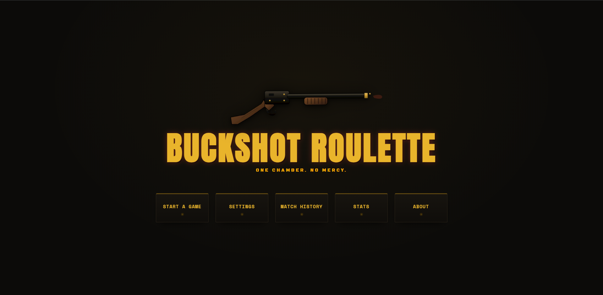

### Match
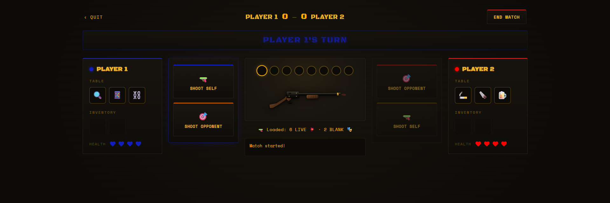
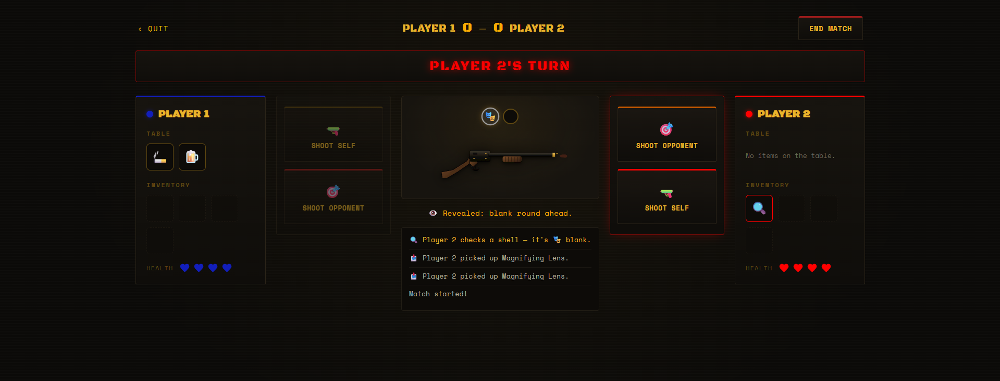
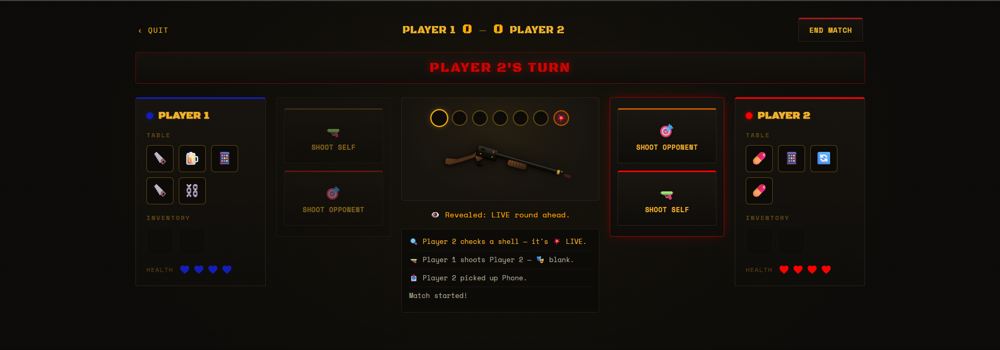
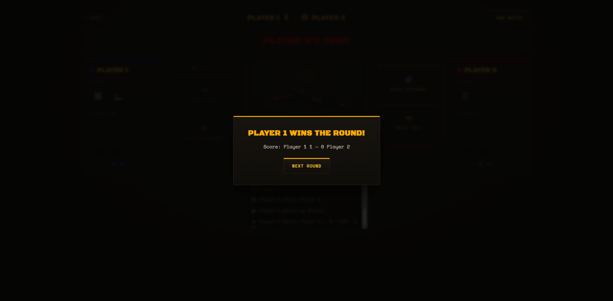
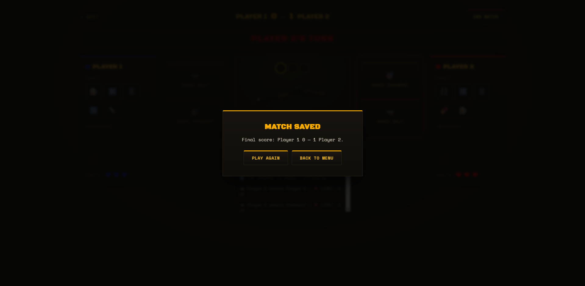

### Settings
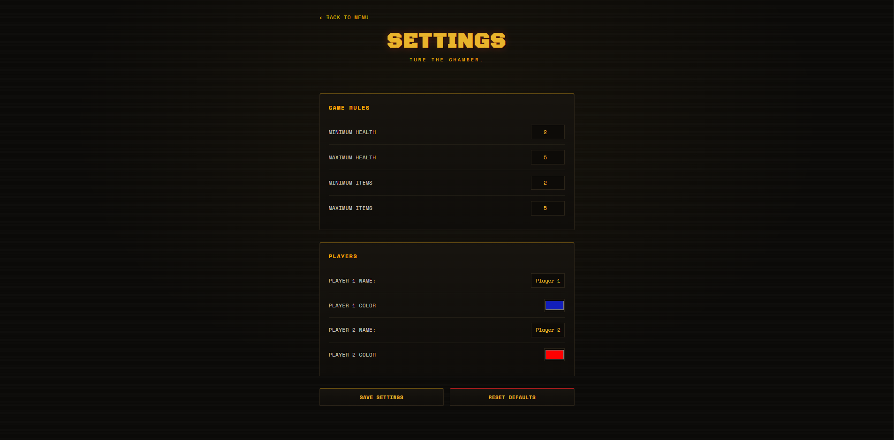

### Match History
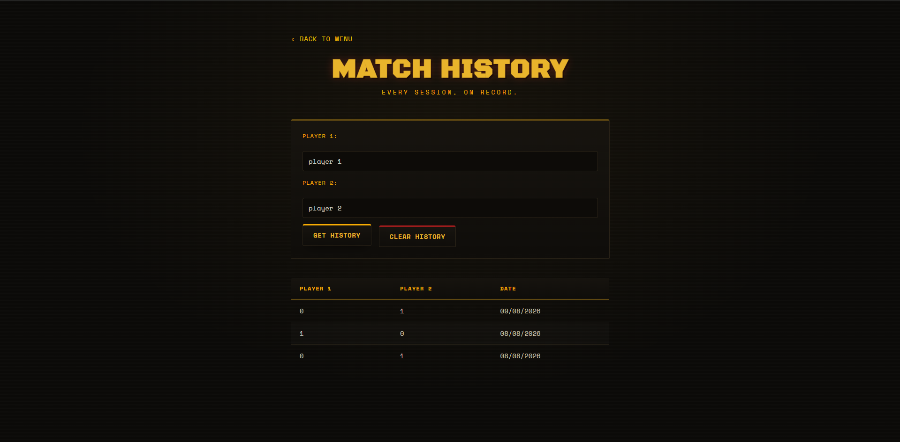

### Stats & Achievements
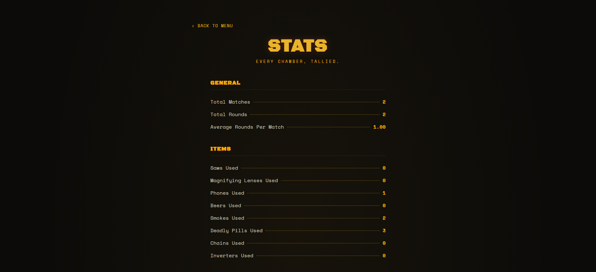
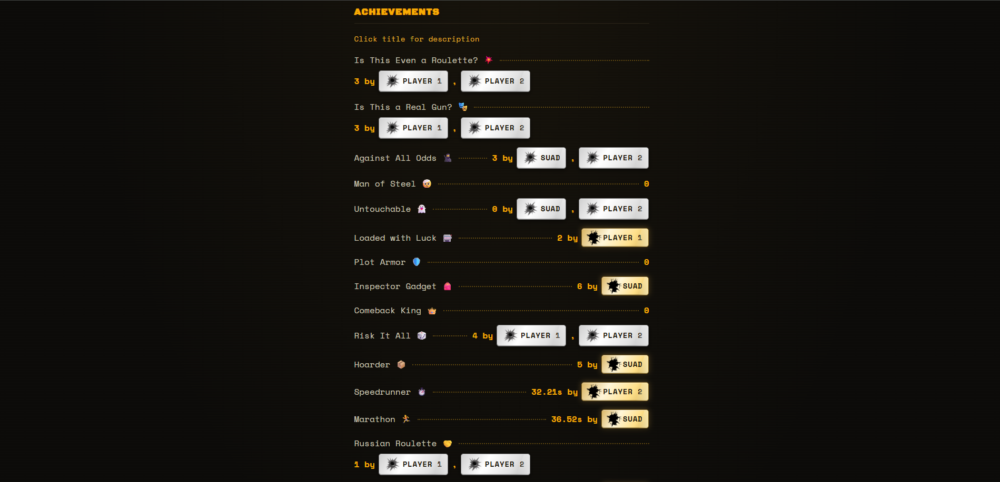


### About
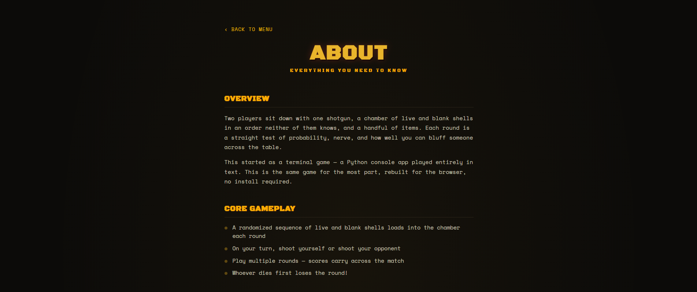
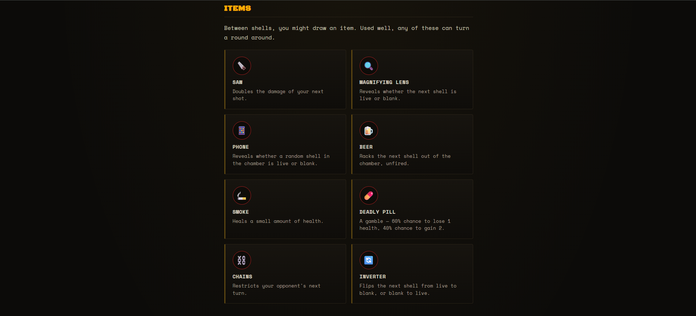
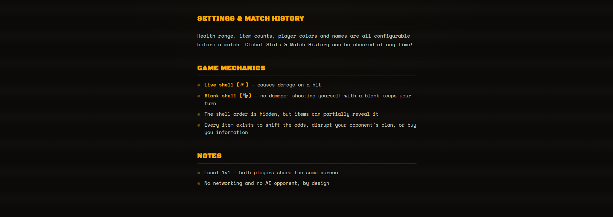

## 📄 License

© 2026 Manar Merhi. All rights reserved.